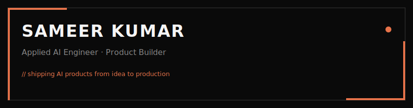

<div align="center">

<!-- BANNER -->


<br/>

<!-- SOCIAL BADGES — brutalist flat style -->
<a href="https://sameer-dev.netlify.app/">
  
</a>&nbsp;&nbsp;
<a href="https://www.linkedin.com/in/sameerkumar-dev">
  
</a>&nbsp;&nbsp;
<a href="mailto:sameerk.dev.in@gmail.com">
  
</a>

</div>

<br/>

<!-- DIVIDER -->


## About

```
┌─────────────────────────────────────────────────────────────────────┐
│                                                                     │
│   Name        Sameer Kumar                                          │
│   Title       Full Stack Developer                                  │
│   Location    India                                                 │
│   Focus       Applied AI · Full-Stack · Product Building            │
│                                                                     │
│   Philosophy  "Ship fast. Ship often. Make AI do the boring stuff." │
│                                                                     │
└─────────────────────────────────────────────────────────────────────┘
```

<br/>


## Experience

<table>
  <thead>
    <tr>
      <th width="160">Role</th>
      <th width="160">Company</th>
      <th>What I Did</th>
    </tr>
  </thead>
  <tbody>
      <tr>
      <td><strong>Full Stack Developer</strong></td>
      <td><a href="https://atsuyatech.com/"><code>Atsuya</code></a></td>
      <td>Developed IoT-enabled asset management platforms using React, React Native, Spring Boot, Kafka, and AI analytics for real-time monitoring.
</td>
    </tr>
    <tr>
      <td><strong>Full Stack Developer</strong></td>
      <td><code>TrippleAtt</code></td>
      <td>Developed a grocery delivery platform with Android, Razorpay, Google Maps, and admin dashboard, streamlining ordering, payments, tracking, and operations.
</td>
    </tr>
  </tbody>
</table>

<br/>


## What I Build

<table>
  <tr>
    <!-- <td width="50%" valign="top">
      <h4>🧠 Applied AI</h4>
      <p>
        &nbsp;
        &nbsp;
        &nbsp;
        &nbsp;
        &nbsp;
        
      </p>
    </td> -->
    <td width="50%" valign="top">
      <h4>🚀 Product Engineering</h4>
      <p>
        &nbsp;
        &nbsp;
        &nbsp;
        &nbsp;
        &nbsp;
        
      </p>
    </td>
  </tr>
</table>

<br/>


## Tech Stack

<div align="center">

<table>
  <thead>
    <tr>
      <th>Category</th>
      <th>Technologies</th>
    </tr>
  </thead>
  <tbody>
    <!-- <tr>
      <td><strong>AI & Data</strong></td>
      <td>
        
        
        
        
      </td>
    </tr> -->
    <tr>
      <td><strong>Frontend</strong></td>
      <td>
        
        
        
        
        
      </td>
    </tr>
    <tr>
      <td><strong>Backend</strong></td>
      <td>
        
        
        
      </td>
    </tr>
    <tr>
      <td><strong>Databases</strong></td>
      <td>
        
        
        
        
      </td>
    </tr>
    <tr>
      <td><strong>DevOps</strong></td>
      <td>
        
        
        
        
      </td>
    </tr>
  </tbody>
</table>

</div>

<br/>


<!-- SNAKE -->
<div align="center">
  <picture>
    <source media="(prefers-color-scheme: dark)" srcset="https://raw.githubusercontent.com/sameer2506/sameer2506/output/github-snake-dark.svg" />
    <source media="(prefers-color-scheme: light)" srcset="https://raw.githubusercontent.com/sameer2506/sameer2506/output/github-snake.svg" />
    
  </picture>
</div>

<br/>


## Stats

<div align="center">
  
  
</div>

<div align="center">
  
  
</div>

<br/>


<div align="center">

  <a href="https://nbarkiya.xyz/contact">
    
  </a>

<br/><br/>

  

</div>

<!---
namanbarkiya/namanbarkiya is a ✨ special ✨ repository because its `README.md` (this file) appears on your GitHub profile.
You can click the Preview link to take a look at your changes.
--->
